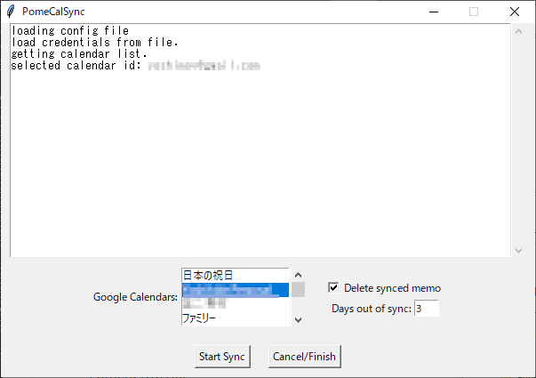

PomeCalSync
===========

## 概要

　ポメラDM100, DM200のカレンダーメモを、指定したGoogleカレンダーに
同期するツールです。

　動作確認はDM100で行っています。

## 動作環境

- Windows 10 (2004 64bit)
- Pomera DM100/DM200
- Python 3.9 (exeに内蔵)

## インストール

　以下の場所からpomecalsync.exeをダウンロードして、適当なフォルダに置いて
実行してください。

- <https://github.com/yoshimov/pomecalsync/releases>

　同じフォルダに設定ファイル(pcsconfig.yml)やトークン(google-calendar.dat)などが
保存されます。

## 使い方

　最初に使うときはブラウザが開いて、Googleカレンダーへのアクセス許可を求める
画面が表示されますので、承認してください。二回目以降は承認作業は不要です。

　カレンダーへのアクセスが許可されると、お使いのGoogleカレンダーの一覧が
リストで表示されます。
ポメラをPCに接続してPCリンクモードにした後、
メモの同期先のカレンダーを選択して「Start Sync」ボタンを押すと、
カレンダーメモがGoogleカレンダーに同期されます。

## 注意点

- メモは「memo」という名前の予定としてGoogleカレンダーに登録されます。
- Googleカレンダーに登録されたメモはポメラから削除されます。削除しない設定もできます。
    - 削除しない場合は、同期済みのメモの先頭行に「★付箋文★」が付きます。
- 「★付箋文★」から始まるメモは同期しません。
- 直近３日間のメモは同期されません。日数は設定で変更できます。
- Googleカレンダーのメモを変更しても、ポメラには反映されません。

## ビルド

　以下のコマンドで実行ファイルを作成できます。

    > python setup.py install
    > pyinstaller main.spec

## ライセンス

本ツールはMIT Licenseです。
自由に配布、改変してください。
